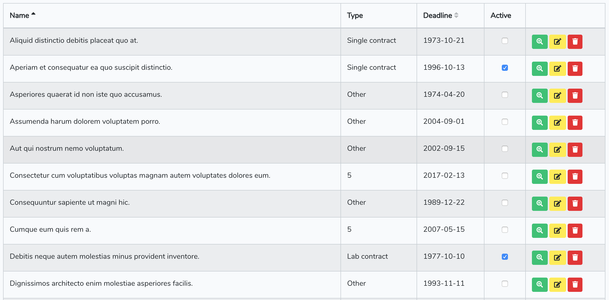

# Laravel Blade view generator - Table

Generate Table view in pure blade HTML template format, this is useful for CRUD functions

## Getting Started

### Installing


```
composer require scuti/laravel-table
```

## License

This project is licensed under the MIT License - see the [LICENSE](LICENSE) file for details

# Usage
## Basic usage

```blade
{{-- index.blade.php --}}

@extends('layouts.admin')
@php
    //Prepare attributes of table
    $table = [
        'data' => $dataArray //array
        'columns' => [
            [
                'title' => 'Name',
                'field' => 'name',
                'cell' => 'text',
                'sortable' => true
            ], [
                'title' => 'Type',
                'field' => 'type_id',
                'cell' => 'constant',
                'options' => [
                    'values' => [
                        1 => __('Lab contract'),
                        2 => __('Single contract'),
                        3 => __('Other')
                    ]
                ]
            ], [
                'title' => 'Deadline',
                'field' => 'deadline',
                'cell' => 'text',
                'sortable' => true
            ], [
                'title' => 'Active',
                'field' => 'is_active',
                'cell' => 'checkbox'
            ], [
                'cell' => 'action'
            ]
        ],
        'pagination' => $pagination,
        'ordering' => [
             'field' => request('order_by'),
             'dir' => request('order_dir')
        ],
        'attributes' => [
            'class' => 'table table-responsive-sm table-bordered table-striped table-hover'
        ]
    ]);
@endphp

@section('content')
    {{-- Render table with parameters --}}
    @include('scuti::table', compact('table')) 
@endsection
```
Let's see what we got:

Easy, isn't it?

## Column properties
The following properties to configure all Columns that will be generated on Table.

* `title`
    * The title of the column on header cell.
* `data`
    * The field name to map with `data` array to display on value cells.
* `cell`
    * The cell type to display value. Current supported cell types:
        * `text`: show normal text
        * `constant`: transform display value from an array of constants (use values from `options` property).
        * `checkbox`: show checkbox UI with boolean values
        * `action`: default 3 basic actions (view, edit, delete) of each record row. (TODO: be able to customize the actions) 
* `orderable` (Boolean)
    * To config if this column is sortable, the `field` name will be used in query string.
    * Handle `orderable` column
        * You can override the default handle of submit sortable field by implement javascript function
        ```blade
        {{-- index.blade.php --}}
        <script>
            function handleOrder(orderField) {
                console.log('handle order on field', orderField);
            }
        </script>
        ```
* `options` Other options for customize cells
    * `values` Array
        * An array of constant values to display on cell type `constant`

## Custom cells
You can create your own custom cell or modify the current supported cell types

### Create your cell type
The custom cells can be regconized at `resources/views/table/cells/{type}.blade.php`

The variables can be used in cell:
* `value`
    Value from data array with `field` as key
* `options`
    Column options
    
### Modify current cell types
TBD:
* Publish view
* Modify
